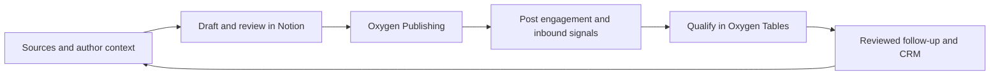
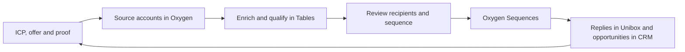

# Adam Robinson Content Engine

A source-backed second brain for Adam Robinson, with a linked context wiki and a searchable archive of public posts and transcripts.

[Notion template](https://prospera-service.notion.site/3d4b3dd667a781dcac4aea561260a788) · [Context index](index.md) · [Oxygen](https://oxygen-agent.com/) · [License and attribution](THIRD_PARTY_NOTICES.md)


This is a worked example of an agent-assisted content engine: research a founder,
build a source-backed knowledge base, draft with reusable skills, organize the
work in Notion, and use Oxygen for collection, publishing and GTM execution.
It includes the knowledge, context, skills and source text from the webinar.
It is research about Adam Robinson, not a claim that he approved every synthesis
or that the included brand assets are yours to reuse.

## Quick start

You need Git and Python 3. A Markdown editor is enough to read the knowledge;
[Obsidian](https://obsidian.md/) also renders the `[[wiki links]]` throughout the
vault. Open this folder in Codex or Claude Code to use the agent rules and skills.
Notion, Oxygen, QMD and the graphics renderer are optional for local reading.

```sh
git clone https://github.com/OXYGEN-CRO/adam-robinson-content-engine.git
cd adam-robinson-content-engine
# Create local settings only if they do not exist yet.
test -f workspace.local.json || cp workspace.example.json workspace.local.json
test -f strategy/notion.local.json || cp strategy/notion.example.json strategy/notion.local.json
./scripts/wiki-lint.sh
```

1. Read [index.md](index.md) for the knowledge map and [AGENTS.md](AGENTS.md) for the working rules.
2. Set your preferences in `workspace.local.json`: author, language, time zone and platforms. Unknown values can stay blank.
3. Duplicate the Notion template below, then connect the Notion MCP to **your copy**.
4. Use the prompt below to explore this worked example. Before creating content for another author, gather their own sources and voice; Adam's experiences are not their biography.

```text
Read AGENTS.md and index.md. Explain the four content pillars and recommend
three source-backed ideas for a LinkedIn post. Cite the original dated sources.
Treat the ideas as drafts and surface any conflicting metrics.
```

For a new author with no inherited research, the separate
[Content Engine Template](https://github.com/OXYGEN-CRO/content-engine-template)
is the blank scaffold. The current repository is the populated webinar example.

## Duplicate the Notion board

Open the [Notion template](https://prospera-service.notion.site/3d4b3dd667a781dcac4aea561260a788),
choose **Duplicate** in the top-right corner, and select your own Notion workspace.
Duplicate the complete parent page so its databases and linked views travel together.
The template contains:

| Database | Included example |
| --- | --- |
| Content Board | Empty board, calendar and pillar views; Idea → Creating → Published, plus Backlog |
| Pillars & Topics | 4 pillars, 26 topics and the subtopics in each topic page |
| Hooks | 17 sourced examples across 14 hook patterns |

Connect Notion through your agent's Notion MCP integration. Give it the URL of
your duplicate and ask it to fetch that parent, inspect its three databases,
and record the new page, database and data source IDs in ignored
`strategy/notion.local.json`. IDs change on duplication. Verify that the Topics
and Pieces views inside each pillar point to your duplicate's data sources.
The public template's IDs are read-only references, never default write targets.

Keep one pillar per piece. Draft bodies use a plain-text code block for paste-ready
copy, with the reader, topic, funnel job and source links outside it. The schema
is documented in [strategy/notion-schema.md](strategy/notion-schema.md).
Changing a Notion status or Publish date does not schedule a social post. The
repository does not install a Notion-to-Oxygen sync; your agent performs the
reviewed handoff described below.

[Notion's duplication guide](https://www.notion.com/en-gb/help/duplicate-public-pages)
explains the public-template flow. Use the blank examples if you only want the
structure; rewrite the sample topics and hook adaptations for your own author.

## Connect Oxygen for scraping and scheduling

[Oxygen](https://oxygen-agent.com/) runs collection, enrichment, scheduled
publishing, sequences and hosted workflows. Create your own workspace, then
follow the [Oxygen quickstart](https://oxygen-agent.com/docs/quickstart).
For the CLI, the current quickstart requires Node.js 22.22+ and npm 10.9+:

```sh
npm install -g @oxygen-agent/cli
oxygen login
```

Or connect your agent to `https://oxygen-agent.com/mcp` using OAuth in the MCP
client. Keep credentials in that connection's authentication store. Only
non-secret preferences and your own organization ID belong in
`workspace.local.json`; nothing here connects you to the webinar owner's account.
Sending and publishing require the applicable Oxygen plan and a connected sender.

Discover the current operation before executing it:

```sh
oxygen capabilities search "scrape public LinkedIn profile posts" --json
oxygen tools search "LinkedIn profile posts" --provider scraper --limit 5 --json
# Use tools get with the exact tool ID returned by that search.
oxygen capabilities search "schedule publish social post" --json
oxygen commands get "publishing posts create" --json
```

Public LinkedIn research uses Oxygen's native cookieless `scraper.*` operations.
Private inbox/network access and posting use the connected account. Save approved
source captures with their URL, date and provenance; file durable insights into
this wiki. Preview collection scope and credit cost before running a paid scrape.
Use [the current docs](https://oxygen-agent.com/docs) for available providers,
account requirements and command schemas.

## Inbound workflow: content → engagement → conversations



1. **Research and draft.** Use `capture-context`, `linkedin-copywriter` or `week-posts` with your author's context. Select one pillar and one funnel job; check the full source and proof ledger. Review the draft on your duplicated Content Board.
2. **Schedule the reviewed post.** Ask your agent to create the post in Oxygen Publishing for the chosen sender, exact text, media, time and time zone. Inspect the returned draft before granting publishing approval. Record the Oxygen post URL in the Notion page; mark it Published only after delivery is verified.
3. **Capture warm signals.** After publication, collect comments and reactions from the chosen post using Oxygen's engagement harvest. Store events and source-post provenance in Oxygen, then deduplicate and qualify the relevant people in a Table against your ICP.
4. **Follow up on intent.** A requested resource or relevant question is a useful trigger. Review the recipient and message. Use Messages/Unibox for existing conversations, and Sequences for a new LinkedIn conversation. A reaction alone is not an instruction to DM everyone.
5. **Learn.** Track qualified conversations and opportunities in CRM and reporting; bring recurring questions and useful replies back into your content research.

Starter prompt:

```text
Use my approved Notion draft and my connected Oxygen workspace. Inspect the
current Publishing schema and prepare the post for my selected sender and time.
Show me the complete text, media, time zone and approval state before release.
Then propose an engagement-harvest and qualification workflow for that post,
with a row limit and credit estimate. Keep follow-up messages as drafts.
```

Oxygen [Publishing and Posts](https://oxygen-agent.com/docs) own delivery and
engagement; Notion holds the editorial plan. This is a workflow to configure in
your workspace, not a preinstalled live campaign.

## Outbound workflow: ICP → accounts → qualified outreach



1. **Define the target.** Use your own audience, offer, exclusions and proof to define the ICP and a specific reason to contact each prospect.
2. **Source and enrich.** Ask Oxygen to prepare a small account/contact sample. Discover the provider, inspect its inputs and cost, and approve a bounded pilot. Use Tables for company research, contact verification, qualification and grounded draft messages.
3. **Review the program.** Deduplicate contacts, apply the do-not-contact list, review the rendered messages and verify sender readiness. Choose channels, delays, sending days, time zone and daily limits.
4. **Launch deliberately.** Build and preview the hosted Sequence. Approve the specific recipients and copy with both a live-send ceiling and a credit ceiling. Oxygen stops a lead's enrollment when they reply.
5. **Handle replies.** Triage in Unibox, honor opt-outs, hand interested conversations to a person, and record the opportunity in CRM. Feed objections back into the knowledge base and future content.

Starter prompt:

```text
Read my ICP, offer and proof. In Oxygen, prepare a 10-account outbound pilot
with an evidence-based qualification reason and proposed contact for each.
Show source provenance, provider costs and missing information before enrichment.
Prepare the sequence copy and preview sender readiness, suppressions, sending
schedule and limits. Present it for review before starting live outreach.
```

Follow Oxygen's [first-sequence guide](https://oxygen-agent.com/docs/guides/first-sequence)
for sender setup, preview, launch limits and reply handling. Use hosted Workflows
for recurring collection, qualification and routing once the pilot is validated;
see [triggers and schedules](https://oxygen-agent.com/docs/execution/triggers).
Keep prospect records and campaign results in your private Oxygen workspace.

## Folder structure

```text
identity/         backstory, mission, values, positioning, proof
audience/         ideal follower, pains and language
strategy/         goals, pillars, funnel and Notion configuration
voice/            writing examples, vocabulary and formats
brand/            MoltSets visual rules, assets and editable graphics kit
inspiration/      creator references and what to learn from them
raw/              original interviews, posts and transcripts
research/         temporary research
templates/        context pages, source manifests and Notion page bodies
scripts/          wiki checks and optional qmd search setup
skills/           13 reusable content, visual and launch-video skills (symlinked from .agents/skills and .claude/skills)
index.md          map of the context pages
log.md            record of what was added or changed
```

The source collection contains 914 Adam-profile LinkedIn records (911 nonempty post bodies) and the latest 100 public YouTube uploads with timestamped transcripts. The original 200-post sample came through Oxygen's managed scraper; the [RB2B archive supplement](raw/sources/2026-09-08-linkedin-rb2b/manifest.md) adds 714 records from the existing Oxygen dev table, extending coverage to February 2023. Three table records have no body text and remain explicitly flagged. Dated web sources supplement the archive. The [context index](index.md) leads to synthesized identity, proof, values, audience, voice and proposed pillars; the raw material stays under `raw/sources/` for retrieval when needed. The original 200-post synthesis is now extended by a focused review of older posts, recorded in [the context review](research/context-expansion-review.md). The [YouTube library](strategy/youtube-library.md) links the detailed video notes and reports their coverage.

The public Notion board is the duplicable editorial companion. The [MoltSets graphics system](brand/BRAND.md) is documented separately under its own brief.

Start with the [ideal follower](audience/ideal-follower.md), [reader pains](audience/pains-and-questions.md), [positioning](identity/positioning.md) and [editorial direction](strategy/editorial-direction.md) when preparing a brief.

## Use the second brain

1. Start at [index.md](index.md) and read the relevant synthesized context.
2. Search QMD for a specific idea, person, metric or source phrase.
3. Open the full dated source passage before making a claim. Read [proof.md](identity/proof.md) for current versus historical metrics and [source-policy.md](strategy/source-policy.md) for attribution.
4. Keep new sources in dated, append-only raw folders with manifests. Update the relevant wiki pages and append to the log.
5. Before new public copy, establish the current brief, offer, publishing choices and author review. The wiki's interpretations are drafts.

The archive is available on demand; it does not need to be loaded wholesale for each task. Claude Code and Codex read the same repository rules and skills. For an exact phrase, preserve quotes inside the QMD query, for example `./scripts/qmd.sh search '"about to cross"' -c context`. Use `rg -n -F "phrase" raw/sources/` to search original files directly.

## Checks and local search

```sh
./scripts/wiki-lint.sh
./scripts/qmd-setup.sh                  # initialize this checkout if needed
./scripts/qmd.sh search "backstory" -c context
python3 scripts/build_context_catalog.py
./scripts/qmd-refresh.sh --embed        # refresh text search and vectors
```

QMD is configured with an isolated index for this repository. Source text and synthesized pages are embedded locally; no other client's collection or global agent configuration is changed. `qmd-refresh.sh` without `--embed` updates text search only. The embedding option uses the installed QMD runtime and its embedding model.

Search includes the raw archive and reviewed wiki. Temporary `output/` exports and duplicate original `research/youtube-video-notes/` renders are excluded from QMD; those files remain available through `rg`. Reviewed video notes live in `strategy/video-notes/`, with explicit correction records that preserve the original model outputs.

Verify capture integrity with `python3 scripts/verify_linkedin_context.py` and `python3 scripts/verify_youtube_context.py`. These recompute counts, identity, recency selection and text fidelity from the preserved raw objects.

Verify the expanded LinkedIn archive with `python3 scripts/import_rb2b_linkedin.py --check`. This checks the complete exported table, attribution, exact overlapping bodies and every additional readable post. Browse the [archive by year](raw/sources/2026-09-08-linkedin-rb2b/index.md), or search it through the same repo-scoped QMD wrapper.

[Structural provenance](templates/origin.md)

## Reusable skills

The skills read the current author's context. They contain no preset name, voice, palette, posting schedule or workspace IDs.

| Skill | Purpose |
| --- | --- |
| `setup-workspace` | Configure local preferences and optional connections |
| `capture-context` | Ingest interviews, notes and sources |
| `voice-calibration` | Derive a voice guide from writing samples and edits |
| `content-strategy` | Define pillars, topics and funnel paths |
| `linkedin-copywriter` | Draft or edit one post |
| `week-posts` | Plan and draft a week |
| `repurpose-content` | Extract distinct pieces from a long source |
| `graphics-designer` | Create graphics, carousels and banners |
| `flowchart` | Draw editable workflows, system maps and funnels |
| `brand-system` | Establish or update the author's visual rules |
| `brand-review` | Inspect rendered assets |
| `launch-video` | Plan and produce a sourced product launch video |
| `qmd` | Retrieve source context with isolated local search |

This repository remains the populated webinar example, with blank connection settings for each clone. For a new client, use the separate [Content Engine Template](https://github.com/OXYGEN-CRO/content-engine-template), which has blank configuration and no inherited client history. Its ZIP can be shared without GitHub access.

The skills do not bundle a renderer, video engine or diagram app. They use tools available in the client's environment and report when a render or export cannot be verified.

## Public release and credentials

The public repository is a fresh export of the working tree. It preserves the
knowledge and source text while excluding local connection files, historical
Git objects, browser state and research-only media. Scraper continuation tokens
and signed download queries are removed from JSON transport metadata. The
public `PUBLIC_RELEASE_MANIFEST.json` records exclusions and changed-file hashes.
When YouTube metadata changes, `SHA256SUMS` verifies the public bytes and
`SHA256SUMS.capture` preserves the original capture checksums.

The raw-source rule remains append-only for subsequent work. A release's
transport sanitization is documented explicitly; it does not silently rewrite
source prose. Some historical local media links therefore refer to assets that
are intentionally absent from the public edition. Brand audio audition requires
your own licensed replacement files.

See [SECURITY.md](SECURITY.md) for secret scans and private reporting,
[CONTRIBUTING.md](CONTRIBUTING.md) for changes, and
[THIRD_PARTY_NOTICES.md](THIRD_PARTY_NOTICES.md) for license boundaries.
Original code, skills, templates and original documentation use the
[MIT license](LICENSE); source posts, transcripts and third-party assets retain
their owners' rights.
